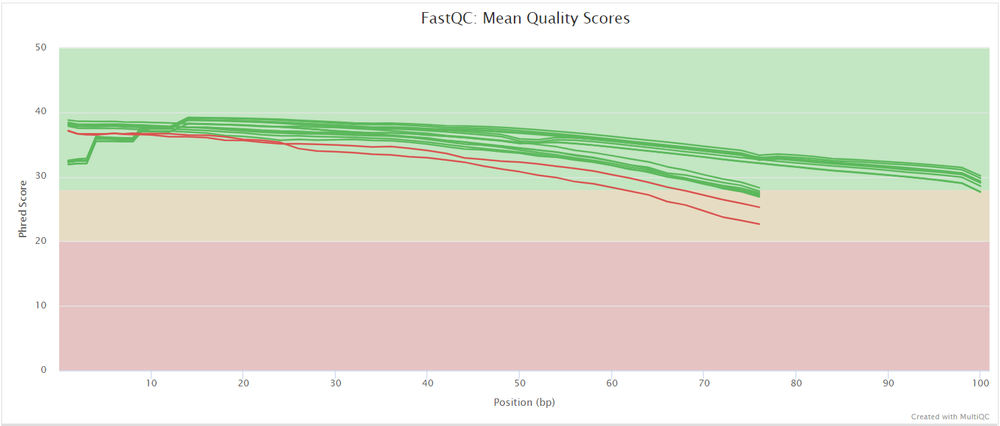

# nf-core/createpanelrefs: Output

## Introduction

This document describes the output produced by the pipeline. Most of the plots are taken from the MultiQC report, which summarises results at the end of the pipeline.

The directories listed below will be created in the results directory after the pipeline has finished. All paths are relative to the top-level results directory.

<!-- TODO nf-core: Write this documentation describing your workflow's output -->

## Pipeline overview

The pipeline is built using [Nextflow](https://www.nextflow.io/) and processes data using the following steps:

- [MultiQC](#multiqc) - Aggregate report describing results and QC from the whole pipeline
- [GATK's germlinecnvcaller](#germlinecnvcaller) - Publish read counts, ploidy and cnvcalling models that can be used to call cnv's in the case mode.
- [Pipeline information](#pipeline-information) - Report metrics generated during the workflow execution

### FastQC

Output files

- `fastqc/`
  - `*_fastqc.html`: FastQC report containing quality metrics.
  - `*_fastqc.zip`: Zip archive containing the FastQC report, tab-delimited data file and plot images.

[FastQC](http://www.bioinformatics.babraham.ac.uk/projects/fastqc/) gives general quality metrics about your sequenced reads. It provides information about the quality score distribution across your reads, per base sequence content (%A/T/G/C), adapter contamination and overrepresented sequences. For further reading and documentation see the [FastQC help pages](http://www.bioinformatics.babraham.ac.uk/projects/fastqc/Help/).

:::note
The FastQC plots displayed in the MultiQC report shows _untrimmed_ reads. They may contain adapter sequence and potentially regions with low quality.
:::

### GATK germlinecnvcaller

Output files

- `results/germlinecnvcaller/`
  - `determinecontigploidy`
    - `cohort-model`: Contig ploidy model.
  - `germlinecnvcaller`
    - `*_model`: CNV caller model for each scattered shard.
  - `readcounts`
    - `*.hdf5|.tsv`: Read count statistics for each sample.
  - `references`
    - `*.dict`: Sequence dictionary file. This file is not published if user supplies this file to the pipeline using the `--dict` parameter.
    - `*.fai`: Fasta index file. This file is not published if user supplies this file to the pipeline using the `--fai` parameter.
  - `VCF`
    - `*_denoised.vcf.gz`: Denoised copy number ratios.
    - `*_genotyped_intervals.vcf.gz`: Most likely copy number calls for each genomic interval included in the interval list.
    - `*_genotyped_segments.vcf.gz`: Coalesce contiguous intervals with the same copy number calls into constant copy number segments .
    

[GATK](https://github.com/broadinstitute/gatk) is a toolkit which offers a wide variety of tools with a primary focus on variant discovery and genotyping. In this pipeline we have implemented GATK's germlinecnvcalling workflow for analysing a cohort of samples. The output files generated from this analysis can be used for analysing samples in case mode. For more information about the workflow and output files, see GATK's documentation [here.](https://gatk.broadinstitute.org/hc/en-us/articles/360035531152--How-to-Call-common-and-rare-germline-copy-number-variants)

### MultiQC

Output files

- `multiqc/`
  - `multiqc_report.html`: a standalone HTML file that can be viewed in your web browser.
  - `multiqc_data/`: directory containing parsed statistics from the different tools used in the pipeline.
  - `multiqc_plots/`: directory containing static images from the report in various formats.

[MultiQC](http://multiqc.info) is a visualization tool that generates a single HTML report summarising all samples in your project. Most of the pipeline QC results are visualised in the report and further statistics are available in the report data directory.

Results generated by MultiQC collate pipeline QC from supported tools e.g. FastQC. The pipeline has special steps which also allow the software versions to be reported in the MultiQC output for future traceability. For more information about how to use MultiQC reports, see <http://multiqc.info>.

### Pipeline information

Output files

- `pipeline_info/`
  - Reports generated by Nextflow: `execution_report.html`, `execution_timeline.html`, `execution_trace.txt` and `pipeline_dag.dot`/`pipeline_dag.svg`.
  - Reports generated by the pipeline: `pipeline_report.html`, `pipeline_report.txt` and `software_versions.yml`. The `pipeline_report*` files will only be present if the `--email` / `--email_on_fail` parameter's are used when running the pipeline.
  - Reformatted samplesheet files used as input to the pipeline: `samplesheet.valid.csv`.
  - Parameters used by the pipeline run: `params.json`.

[Nextflow](https://www.nextflow.io/docs/latest/tracing.html) provides excellent functionality for generating various reports relevant to the running and execution of the pipeline. This will allow you to troubleshoot errors with the running of the pipeline, and also provide you with other information such as launch commands, run times and resource usage.
